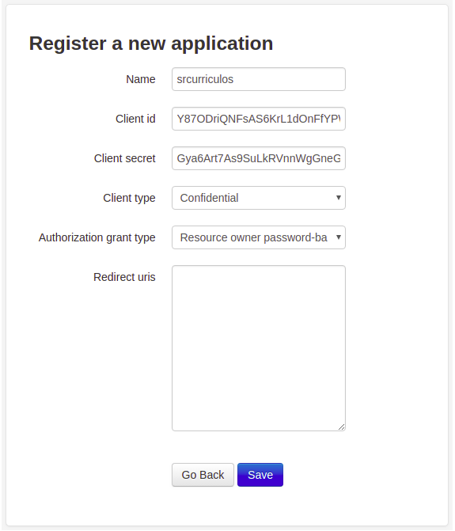

# SrCurriculos


**A fully integrated Docker + DJango + DJango REST Framework and OAuth2 + PostgreSQL application.**


## How to Build

1. Download & Install [Docker](https://docs.docker.com/install/linux/docker-ce/ubuntu/) and [Docker-Compose](https://docs.docker.com/compose/install/)
2. Clone this repository with `git clone https://github.com/geevb/django-rest-app.git`
3. Access downloaded repository with cd  `cd django-rest-app/`
4. Start containers with `docker-compose up -d db && docker-compose up -d web`
5. After the startup, run Django migrate to apply OAuth2 and PostgreSQL with `docker exec -ti django_1 python manage.py migrate`
6. Run `docker exec -ti django_1 python manage.py createsuperuser` and follow instructions to create a Super User.


## How to Run

1. After creating the Super User, login with it at: `http://localhost:8000/admin/`
2. Then, create new Application here: `http://localhost:8000/o/applications/`
3. Fill the form with this config, **save it**



4. Lastly, get both `CLIENT_ID` and `CLIENT_SECRET` values and insert them at `django_rest_app/settings.py` lines 137 and 138, respectively. **Save the file.**


## Testing the API

1. You can use Curl to test the endpoints, but it will be a lot easier if you import the `srCurriculos.postman_collection.json` into **Postman.**
2. The collection provided has all the methods pre-configured to all endpoints created in this application.
3. Note that, the first endpoint that needs to be consumed is the `Add new user` with the body:
```JSON
{
    "username":"<Desired_Username>",
    "password":"<Desired_Password>"
}
```
This will return the Access Token that needs to be used as authentication in every request after this as `Bearer Token`.
To renew the token, use the `Request auth. token` in the Postman Collection.

After everything's done, shutdown the Docker Containers by accessing the main folder `django-rest-app/` and running `docker-compose down`


## What the application does

- [ ] Build and Run Django + Django REST with OAuth2 and PostgreSQL
- [ ] Expose endpoints to **Create** Users and **Create, Edit, Remove** Resumes.
- [ ] On every endpoint, the connection with PostgreSQL will be made, persisting the data as long as the Docker container is up.


## Third parties softwares used

- [ ] [Python-3](https://www.python.org/)
- [ ] [Docker](https://www.docker.com/)
- [ ] [Docker-Compose](https://docs.docker.com/compose/)
- [ ] [Django](https://www.djangoproject.com/)
- [ ] [Django-REST](https://www.django-rest-framework.org/)
- [ ] [Django-OAuth-Toolkit](https://django-oauth-toolkit.readthedocs.io/en/latest/)
- [ ] [PostgreSQL](https://www.postgresql.org/)
- [ ] [Postman](https://www.getpostman.com/)


## Ideas for future implementations

- [ ] WEB UI to interact with the endpoints.
- [ ] Specific user roles and permissions
- [ ] Easier set-up


## Author
[Getúlio Benincá](https://github.com/geevb)
